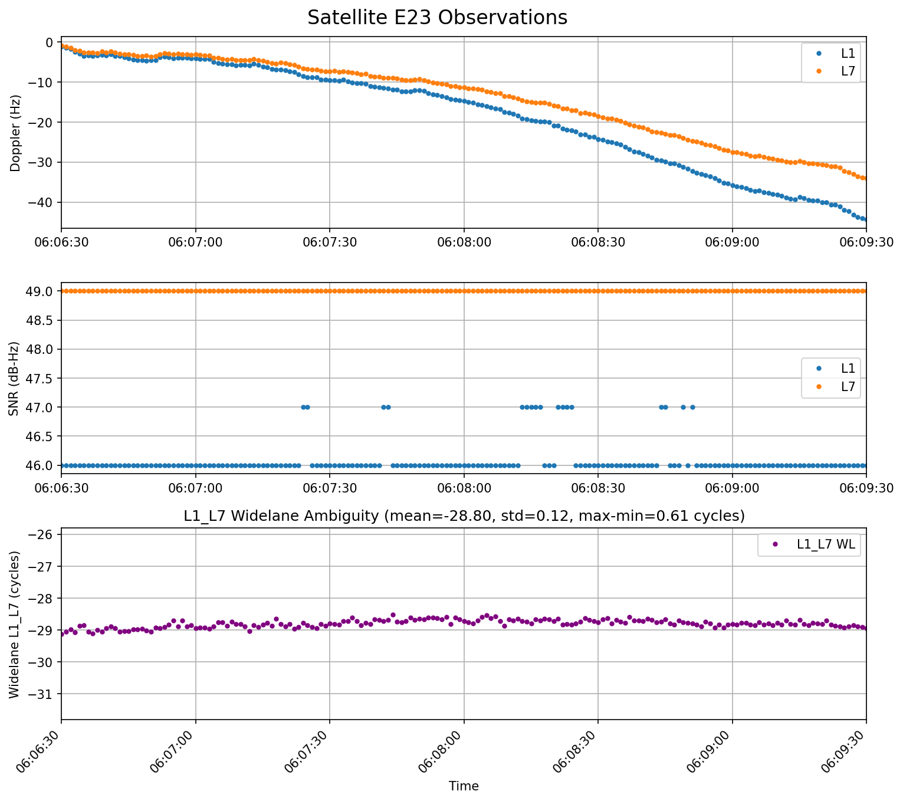
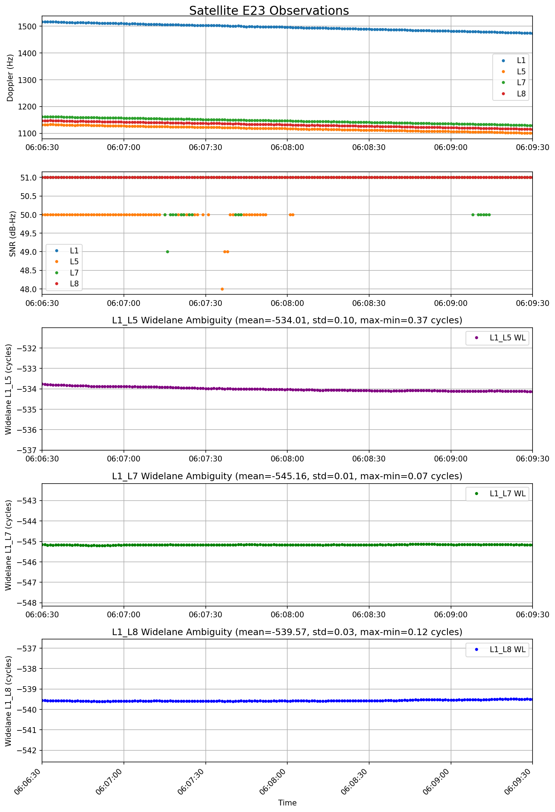

# How to Estimate Phase Bias

## Widelane Ambiguity

### Carrier-Phase Observation Equations

The carrier-phase range observations at two frequencies can be expressed as:

$$
\begin{align}
L_1 = c(t_r-t^s) + T - I_1 + \lambda_1 N_1 + \epsilon_{L,1}\\
L_2 = c(t_r-t^s) + T - I_2 + \lambda_2 N_2 + \epsilon_{L,2}
\end{align}
$$

Where:
- $\Phi_1, \Phi_2$: phase observations at frequency 1 and 2 (in cycles)
- $L_1$, $L_2$: Phase range (meters)
- $\rho$: geometric distance between receiver and satellite (meter)
- $c$: speed of light (meter/second)
- $t^s, t_r$: receiver and satellite clock with clock error for each
- $T$: tropospheric delay
- $I_1, I_2$: ionospheric delays at frequency 1 and 2 (proportional to $f^{-2}$) in meter
- $N_1, N_2$: integer ambiguities (cycles)
- $\epsilon_{\Phi1}, \epsilon_{\Phi2}$: measurement noise

### Phase Widelane Combination

Taking sum of the tow phase observations

$$
\Phi_1 + \Phi_2 = \left(\frac{1}{\lambda_1} + \frac{1}{\lambda_2}\right) \left(c(T_r - t^s) + T\right) - \frac{I_1}{\lambda_1} - \frac{I_2}{\lambda_2} + N_1 + N_2 + \epsilon_{L,1} +  + \epsilon_{L,2}
$$

We can thnik new frequency or wavelength for this combined measurement.

$$
\frac{1}{\lambda_1} + \frac{1}{\lambda_2} = \frac{1}{\lambda_{WL}}
$$

or if we remind $\lambda = \frac{c}{f}$,

$$
\frac{1}{\lambda_1} + \frac{1}{\lambda_2} = \frac{f_1}{c} + \frac{f_2}{c} = \frac{f_{WL}}{c}
$$

The following table presents GPS frequency and wavelength parameters for common widelane combinations. Note that the widelane wavelength is significantly longer than the individual carrier wavelengths, which facilitates ambiguity resolution by reducing the search space.

band | $f_1$ (MHz) |  $f_2$ (MHz) | $f_{WL}$ (MHz) | $\lambda_1$ (cm)  | $\lambda_2$ (cm)  | $\lambda_{WL}$ (cm) |
:---:|:---:|:---:|:---:|:---:|:---:|:---:|
L1+L2 | 1575.42 | 1227.60 | 347.82  | 19.03 | 24.42 | 86.22 |
L1+L5 | 1575.42 | 1176.45 | 398.97 | 19.03 | 25.48 | 75.18 |

Using phase length $L_1$ and frequency $f_1$ instead of phase $\Phi_1$ and wave length $\lambda_1$, we can write

$$
\lambda_{WL} (\Phi_1 + \Phi_2) = \frac{f_1}{f_1+f_2} L_1 + \frac{f_2}{f_1+f_2} L _ 2
$$

Substituting the observation equations,

$$
\begin{align}
\frac{f_1}{f_1+f_2} L_1 + \frac{f_2}{f_1+f_2} L _ 2 = c(T_r-t^s) + T - \frac{f_1}{f_1+f_2} I_1  - \frac{f_2}{f_1+f_2} I_2 + \lambda_{WL} (N_1 + N_2) + \epsilon_{L,WL}
\end{align}
$$

Its noise is

$$
\epsilon_{L,WL} = \frac{f_1}{f_1+f_2} \epsilon_{L,1} + \frac{f_2}{f_1+f_2} \epsilon_{L,2}
$$

If we set equal variance of the $\epsilon_{L,1}=\epsilon_{L,2} = \epsilon_L$, the phase wide lane noise varaince would be

$$
\sigma_{L,WL}^2 = \left(\frac{f_1}{f_1+f_2}\right)^2 \sigma_L^2 + \left(\frac{f_2}{f_1+f_2}\right)^2 \sigma_L^2 = \sigma_L^2 \frac{f_1^2 + f_2^2}{(f_1+f_2)^2}
$$

Note the scale factor $\frac{f_1^2 + f_2^2}{(f_1+f_2)^2}$ is less than 1.

band | scale factor
:---:|:---:
L1+L2 | 0.5078
L1+L5 | 0.5104

### Code Range Narrow Lane

Code range observation equations are

$$
\Rho_1 = c(t_r-t^s) + T + I_1 + \epsilon_{\Rho,1}
$$

$$
\Rho_2 = c(t_r-t^s) + T + I_2 + \epsilon_{\Rho,1}
$$

In the same manner of phase widelane linear combination, narrow lane linear combination of code range can be defined as

$$
\frac{f_1}{f_1-f_2} \Rho_1 - \frac{f_2}{f_1-f_2} \Rho_2 = c(t_r-t^s) + T + \frac{f_1}{f_1-f_2} I_1 - \frac{f_2}{f_1-f_2} I_2 + \epsilon_{\Rho,NL}
$$

and

$$
\frac{1}{\lambda_1} - \frac{1}{\lambda_2} = \frac{1}{\lambda_{NL}}
$$

or

$$
f_{NL} = f_1 - f_2
$$

The narrow-lane combination uses the frequency difference to produce a shorter wavelength, which provides improved precision for fixing the widelane ambiguity.

band | $f_1$ (MHz) |  $f_2$ (MHz) | $f_{NL}$ (MHz) | $\lambda_1$ (cm)  | $\lambda_2$ (cm)  | $\lambda_{NL}$ (cm) |
:---:|:---:|:---:|:---:|:---:|:---:|:---:|
L1-L2 | 1575.42 | 1227.60 | 2803.02 | 19.03 | 24.42 | 10.70 |
L1-L5 | 1575.42 | 1176.45 | 2751.87 | 19.03 | 25.48 | 10.90 |

Noise terms is

$$
\epsilon_{\Rho,NL} = \frac{f_1}{f_1-f_2} \epsilon_{\Rho,1}  - \frac{f_2}{f_1-f_2} \epsilon_{\Rho,2}
$$

If we set equal variance of the $\epsilon_{\Rho,1}=\epsilon_{\Rho,2} = \epsilon_\Rho$, the code narrow lane noise variance would be

$$
\sigma_{\mathrm{\Rho},NL}^2 = \left(\frac{f_1}{f_1-f_2}\right)^2 \sigma_\Rho^2 + \left(\frac{f_2}{f_1-f_2}\right)^2 \sigma_\Rho^2 =  \frac{f_1^2 + f_2^2}{(f_1-f_2)^2} \cdot \sigma_{\mathrm{\Rho}}^2
$$

Note the scale factor $\frac{f_1^2 + f_2^2}{(f_1-f_2)^2}$ is much larger than 1, meaning noise is significantly amplified in the narrow-lane combination. This noise amplification is a trade-off for achieving shorter wavelength and improved precision.

band | scale factor
:---:|:---:
L1-L2 | 32.96
L1-L5 | 24.27

## Ambiguity of Widelane

The widelane ambiguity can be isolated through the differencing of phase widelane and code narrow-lane measurements:

$$
\left(\frac{f_1}{f_1+f_2} L_1 + \frac{f_2}{f_1+f_2} L_2 \right) - \left(\frac{f_1}{f_1-f_2} \Rho_1 - \frac{f_2}{f_1-f_2} \Rho_2 \right) \approx \lambda_{WL} (N_1+N_2) + \epsilon_{L,WL} - \epsilon_{\Rho,NL}
$$

First, this approximation is abount from ionospheric delay modeling proportional to TEC(Total Electron Content) and the second order inversely frequency, $I\propto \frac{\mathrm{TEC}}{f^2}$. The ionospheric term is completely canceled in within this modeling. Ionosphere term in phase widelane is

$$
-\frac{f_1}{f_1+f_2} I_1 - \frac{f_2}{f_1+f_2} I_2 \approx -\frac{f_1}{f_1+f_2} \frac{TEC}{f_1^2} - \frac{f_2}{f_1+f_2} \frac{TEC}{f_2^2} = -\frac{TEC}{f_1 f_2}
$$

while the code narrow lane ionospheric term is

$$
\frac{f_1}{f_1-f_2} I_1 - \frac{f_2}{f_1-f_2} I_2 = \frac{f_1}{f_1-f_2} \frac{TEC}{f_1^2} - \frac{f_2}{f_1-f_2} \frac{TEC}{f_2^2} = -\frac{TEC}{f_1 f_2}
$$

Remarkably, both combinations yield the same ionospheric term $-\frac{TEC}{f_1 f_2}$, which demonstrates the ionosphere-free property of this widelane-narrow-lane differencing approach.

Secondary, this linear combination removes common errors (geometric range, clock, troposphere) while isolating the widelane integer ambiguity. The measurement noise in this combination is:

$$
\epsilon_{L,WL} - \epsilon_{\Rho,NL}
$$

Since the narrow-lane code noise ($\sigma_{\Rho,NL}^2$) is significantly larger than the widelane phase noise ($\sigma_{L,WL}^2$) (by factors of ~24-33 times), the noise in the widelane ambiguity measurement is dominated by the code narrow-lane component:

$$
\sigma_{N_{WL}}^2 \approx \sigma_{\Rho,NL}^2 = \frac{f_1^2 + f_2^2}{(f_1-f_2)^2} \sigma_\mathrm{\Rho}^2
$$

This widelane ambiguity can be resolved using integer least-squares methods. Once the widelane ambiguity is fixed, it significantly reduces the search space for resolving the full ambiguity vector, making it a critical step in precise point positioning and baseline determination.

The widelane ambiguity can be recovered separately and resolved with improved success rates due to its longer wavelength and reduced ionospheric effects.

## Data Example

Here we present a computational example. This figure shows the widelane ambiguity for Galileo satellite signals obtained from 2 GNSS receiver, a u-blox F9P receiver and NovAtel OEM7 from the same antenna, plotted using the equations described above. It can be seen that the widelane ambiguity remains constant throughout the observation period.

